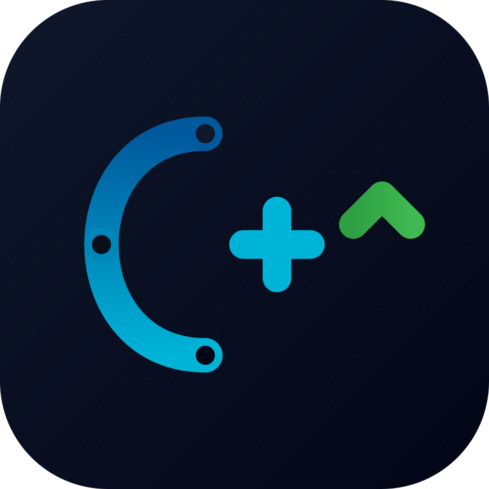

<div align="center">



# CPP-Learning-Journey
**A structured, fully-organized archive of my C++ learning journey — from raw syntax to OOP, operator overloading, inheritance, data structures, and real mini projects.**

[](https://isocpp.org/)
[](.)
[](.)
[](.)
[](https://gcc.gnu.org/)
[](.)
[](./LICENSE)

</div>

---

## What is this repo?

This repository is my personal, cleaned-up archive of everything I wrote while learning C++ — lecture code-alongs, practical sheets, mid-year revisions, and small end-to-end projects. It started as dozens of loosely-named files (`c++_1.cpp`, `rev3.cpp`, `sheet_2.cpp`...) and was reorganized into **13 topic-based folders** that mirror an actual learning path, from `cin >> x` all the way to abstract classes and linked-list data structures.

Every single `.cpp` file has been verified with `g++ -fsyntax-only` — real compile errors (duplicate constructors, redefinitions, bad includes, redeclared variables) were found and fixed rather than just copy-pasted as-is.

---

## Features

| Feature | Detail |
|---|---|
| 🗂️ **Topic-based structure** | 13 numbered folders, ordered by difficulty |
| ✅ **Compile-verified** | Every file passes `g++ -std=c++17 -fsyntax-only` with zero errors |
| 🧹 **Cleaned up** | Removed empty files and IDE-generated `tempCodeRunnerFile` junk |
| 🐛 **Real bugs fixed** | Duplicate constructors, redefined functions, wrong includes, redeclared variables |
| 🏗️ **Two real projects** | A multi-file `Car` header/source project and a full OOP `Bank System` |
| 📚 **Progressive difficulty** | Basics → Arrays → Pointers → OOP → Inheritance → Data Structures → Projects |
| 📝 **Revision sheets** | Dedicated mid-year & final revision files for exam prep |

---

## Topics Covered

| # | Folder | What's inside |
|---|---|---|
| 01 | `Basics` | Variables, functions & parameters, calculators, math (`cmath`) sheets, conditions, loops, competitive-programming warm-ups |
| 02 | `Arrays_and_Strings` | Array functions (sum, max, shift, reverse), char arrays & letter-frequency counting |
| 03 | `Structs` | Plain structs, nested structs (`NameType`, `AddressType`, `Employee_Type`) |
| 04 | `Pointers` | Reference/dereference basics, pointer arithmetic, pointers & arrays, dynamic memory (`new[]` / `delete[]`) |
| 05 | `Multidim_Arrays_and_Scope` | 2D arrays, variable scope (`::`), default arguments, `std::vector` & `std::array` |
| 06 | `OOP_Classes_Basics` | Constructors/destructors, encapsulation, getters/setters, the classic `Rectangle` / `Distance` / `Car` classes |
| 07 | `Static_Members` | Static data members, static methods, object counters |
| 08 | `Operator_Overloading` | Function overloading, `++`/`--` (pre/post), `+ - * /` operator overloads on custom classes |
| 09 | `Inheritance_and_Polymorphism` | Single, multiple & multilevel inheritance, virtual functions, pure virtual (abstract classes), `friend` functions/classes |
| 10 | `Exception_Handling` | `try` / `catch` / `throw`, catching by type, catch-all `(...)` |
| 11 | `Data_Structures_and_Algorithms` | Binary search, a linked-list user database sorted with **QuickSort**, a student registration system (linked list + array-based queue) |
| 12 | `Projects` | **Car_Project** (multi-file `car.h`/`car.cpp`/`main.cpp`) and **Bank_System_OOP** (abstract `Account` class, `InterestBearing`/`Overdraftable` interfaces, `SavingAccount`/`CheckingAccount`/`BusinessAccount`, an interactive console menu) |
| 13 | `Mixed_Revision_Sheets` | General revision files mixing several topics — shape menus, calculators, complex numbers, bank accounts, electricity billing |

---

## Highlighted Projects

### 🚗 Car Project (`12_Projects/Car_Project`)
A minimal but properly separated multi-file project demonstrating header/source separation:
- `car.h` — class declaration
- `car.cpp` — method implementations
- `main.cpp` — usage/demo

### 🏦 Bank System (`12_Projects/Bank_System_OOP`)
A full console-based banking application demonstrating advanced OOP:
- Abstract base class `Account` with pure virtual `deposit()` / `withdraw()`
- Interfaces via pure abstract classes: `InterestBearing`, `Overdraftable`
- Derived classes: `SavingAccount`, `CheckingAccount`, and multilevel-derived `BusinessAccount`
- Aggregation: a `Bank` class holding `vector<Account*>` with full polymorphic dispatch
- Interactive menu for creating accounts, depositing, withdrawing, and listing all accounts

---

## Project Structure

```
.
├── 01_Basics/
├── 02_Arrays_and_Strings/
├── 03_Structs/
├── 04_Pointers/
├── 05_Multidim_Arrays_and_Scope/
├── 06_OOP_Classes_Basics/
├── 07_Static_Members/
├── 08_Operator_Overloading/
├── 09_Inheritance_and_Polymorphism/
├── 10_Exception_Handling/
├── 11_Data_Structures_and_Algorithms/
├── 12_Projects/
│   ├── Car_Project/          # car.h / car.cpp / main.cpp
│   └── Bank_System_OOP/      # Abstract classes, interfaces, aggregation
└── 13_Mixed_Revision_Sheets/
```

---

## Requirements

- A C++17-compatible compiler (e.g. `g++` ≥ 9)
- No external libraries — everything uses only the C++ Standard Library (`<iostream>`, `<cmath>`, `<vector>`, `<string>`, etc.)

---

## Running Any File

Single-file programs:
```bash
g++ -std=c++17 path/to/file.cpp -o program
./program
```

Multi-file Car project:
```bash
cd 12_Projects/Car_Project
g++ -std=c++17 main.cpp car.cpp -o car_app
./car_app
```

---

## Bugs Found & Fixed

While organizing, every file was syntax-checked with `g++ -fsyntax-only`. These real compile errors were found and corrected:

| File | Bug | Fix |
|---|---|---|
| `06_OOP_Classes_Basics/03_revision_car_rectangle_class.cpp` | `Car()` constructor defined twice with identical signature | Removed the duplicate |
| `01_Basics/08_competitive_problem_solving_sheet_2.cpp` | `showBox()` function redefined verbatim | Removed the duplicate |
| `01_Basics/05_revision_basics_full_sheet.cpp` | `#include <Limits>` (invalid capitalization) | Fixed to `#include <climits>` |
| `08_Operator_Overloading/04_revision_counter_all_operators.cpp` | Variable `c7` redeclared 4 times in the same scope; `operator/` had a missing `return` on the divide-by-zero path | Renamed to `c7`–`c10`; added a safe return on error |

---

## Notes

- Some files contain commented-out code — these are intentionally kept as a record of earlier practice attempts and alternative approaches explored while learning, not left over by accident.
- Files named `rev*`, `revision_mid_year_*`, and `final_rev_*` are exam/interview revision sheets and often revisit earlier topics on purpose.

---

<div align="center">
<sub>Built while learning C++ · one concept at a time</sub>
</div>
